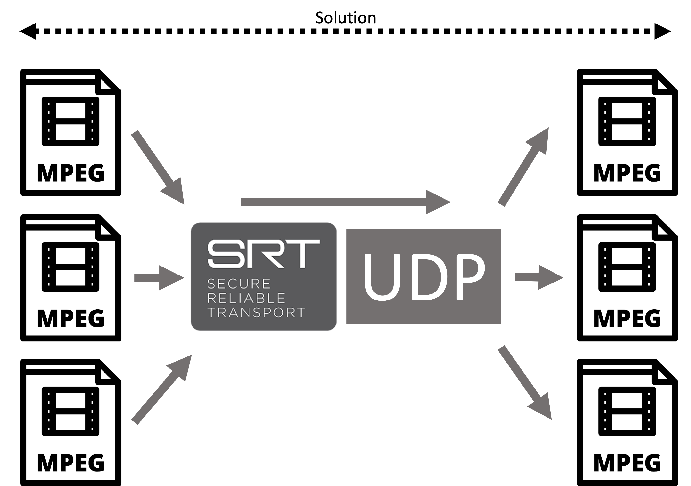

#SRT to UDP Server

Acts as a SRT server and bridges incoming SRT data to UDP

The benefit of this program compared to the included converter in the SRT repo. is that you can process multiple flows from one instance. This solution also implements a REST interface making it simpler to integrate and monitor in cloud environments. 

The implementation also introduces a concept of MPSRTTS (Multi Program SRT Transport Streams) instead of regular MPEG style SPTS squashing to MPTS. The new concept multiplex multiple SPTS (or MPTS!) to a single SRT flow creating a multiple program single SRT stream. This to avoid multiple SRT network flows unaware of each other fighting over the same resources at the aggregation points where bandwidth is scarce. If you are familiar with Ethernets VLAN concept this can be seen as a equivalent for MPEG-TS flows.
This approach may in some cases also simplify the firewall configuration in situations where multiple input flows (meaning incoming SPTS/MPTS over SRT) is fed multiple destinations.


**MPEG-TS mode** (no tag see below)

```
MPEG-TS -> SRT -> UDP

MPEG-TS packets
tsPacket[188]

(To the size of the MTU. Normally seven TS packets, 7*188 meaning a payload size of 1316 bytes)

```

**MPSRTTS mode** (Aggregating MPEG-TS to a single SRT flow)

```
MPEG-TS \      /  MPEG-TS -> UDP
MPEG-TS -> SRT -> MPEG-TS -> UDP
MPEG-TS /      \  MPEG-TS -> UDP

MPSRTTS packets are 189 bytes

uint8_t tag
tsPacket[188]

(To the size of the MTU. Normally Normally seven TS packets, 7*189 meaning a payload of 1323 bytes)

```

**Current auto build status:**


The auto builds produces binaries, get the binary based on the last commit by->

1. Click the 'Actions' tab above
2. Select your platform (to the left)
3. Select the latest build (If you don't know what you're looking for, it's the top most item in the list of builds)
4. Downlod the binary under the Artifacts text.


## Building

Requires cmake version >= **3.10** and **C++17**

*Linux, MacOS and Windows*

(Read below for how to prepare the different systems)

**Release:**

```sh
mkdir build
cd build
cmake -DCMAKE_BUILD_TYPE=Release ..
cmake --build . --config Release
```

***Debug:***

```sh
mkdir build
cd build
cmake -DCMAKE_BUILD_TYPE=Debug ..
cmake --build . --config Debug
```

**Output (Linux and MacOS):**
 
*./srt\_to\_udp\_server*

**Output (Windows):** 
 
*./Release/srt\_to\_udp\_server.exe* (Release version)
 
*./Debug/srt\_to\_udp\_server.exe* (Debug version)


-


# Preparing Ubuntu (Deb)

```sh
sudo apt-get update
sudo apt-get upgrade
sudo apt-get install tclsh pkg-config cmake libssl-dev build-essential
```

# Preparing MacOS

Prepare your system by installing ->

* [Xcode](https://itunes.apple.com/us/app/xcode/id497799835)
. Then start Xcode and let xcode install Command Line Tools or run *xcode-select --install* from the terminal.

* **Homebrew** -> [[https://brew.sh](https://brew.sh))

* Then Install dependencies

```sh
brew install cmake
brew install openssl
export OPENSSL_ROOT_DIR=$(brew --prefix openssl)
export OPENSSL_LIB_DIR=$(brew --prefix openssl)"/lib"
export OPENSSL_INCLUDE_DIR=$(brew --prefix openssl)"/include"
```

# Preparing Windows


Prepare your system by installing->

* [Visual Studio](https://visualstudio.microsoft.com/downloads/)
(Also add the CMake build support if you plan to develop applications)

*  **chocolatey** -> [https://chocolatey.org](https://chocolatey.org)

* Then Install dependencies

```sh
choco install openssl
choco install cmake
choco install git
```

# Preparing CentOS


```sh
sudo yum -y check-update
sudo yum -y update
sudo reboot now
sudo yum -y groupinstall 'Development Tools'
git config --global user.name "your name"
git config --global user.email "your.email@mail.com"
sudo yum -y install centos-release-scl-rh
sudo yum -y install devtoolset-9-toolchain
scl enable devtoolset-9 bash
sudo yum -y install wget
wget https://cmake.org/files/v3.12/cmake-3.12.3.tar.gz
tar zxvf cmake-3.*
cd cmake-3.*
./bootstrap --prefix=/usr/loca
make -j$(nproc)
sudo make install
sudo ln -s /usr/loca/bin/cmake /usr/bin/cmake
cd ..
sudo yum -y install openssl-devel
sudo yum -y install tcl-devel
sudo yum -y install tk-devel
```

If you reboot your CentOS machine and need to build again. Before building you need to ->

```sh
scl enable devtoolset-9 bash
```


## Using the SRT -> UDP bridge


Create a configuration file

Below is a example of MPEG-TS mode transparent mapping where the server accepts 1 SRT connection in and produces 1 UDP stream out.

This configuration is creating a server listening on all interfaces and port 8000 for incomming SRT clients. The key *th15i$4k3y* is used for AES-128 encryption.

The data comming in is sent out on interface 127.0.0.1 port 8100. The payload content can be whatever since the mapping from SRT to UDP is transparent meaning it can be anything MPEG-TS or something else.

There is also a rest interface configured listening at 127.0.0.1:8080
For accessing the REST interface see below.

```
//One part must contain the REST server configuration. Without it the program will not start.
[restif]
rest_ip = 127.0.0.1 		//Listen interface for the REST server
rest_port = 8080			//Listen port for the REST server
rest_secret = superSecret	//The secret token to be used for the command API

[config1] 			//Unique name must contain the word 'config'
listen_port=8000 		//SRT listening port
listen_ip=0.0.0.0 		//SRT listening IP
out_port=8100			//UDP send target port
out_ip=127.0.0.1		//UDP send target port
key=th15i$4k3y 			//PSK used
reorder_distance=4 		//Server SRT reorder tollerance
[new server]..... and so on.
```

Example of a MPSRTTS configuration

REST interface as above

The server is configured as above but there is a 'tag' key configured, this means that the server [config1] is put into MPSRTTS-mode and the incomming data needs to be 189*X bytes where the extra byte is a preamble (tag) infront of the TS 188 byte packet.

flow(x) attached outputs to the server. Tags can be reused if for example a MPEG-TS flow has more than one destination.

```
//This is the configuration for the REST interface
[restif]
rest_ip = 127.0.0.1
rest_port = 8080
rest_secret = superSecret
//This is a configuration for server worker 1
[config1]
listen_port=8000
listen_ip=0.0.0.0
out_port=8100
out_ip=127.0.0.1
key=th15i$4k3y
reorder_distance=4
//The tag key is optional and puts the config into MPSRTTS mode
tag = 8
//a MPSRTTS configuration can be attached a flow. The flow must be entered after the configuration block
//The flow configures what to bind to. What tag should be served and the output if and port
[flow1]
bind_to=config1
out_port=8102
out_ip=127.0.0.1
tag = 11
[flow2]
bind_to=config1
out_port=8103
out_ip=127.0.0.1
tag = 14
```


Then start the server:

```sh
./Executable configuration.file

```

**REST API:**

Talk to the REST API like this:

```
(key:value)
token:(your secret as defined in the ini file)
command:(The command you want to execute)

Current commands:

dumpall
Returns statistics about all current running servers
```

//Example

```sh
curl --header "Content-Type: application/json" --request POST --data '{"token":"superSecret","command":"dumpall"}' http://127.0.0.1:8080/restapi/version1
```


## License

*MIT*

Read *LICENCE.md* for details